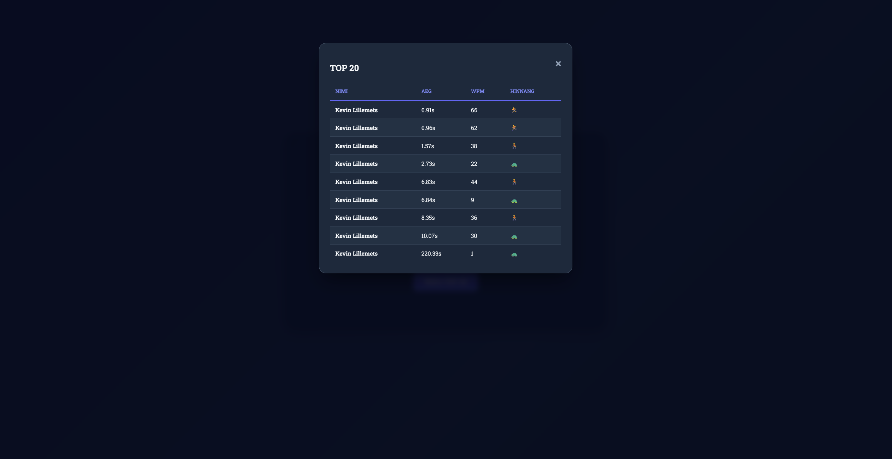
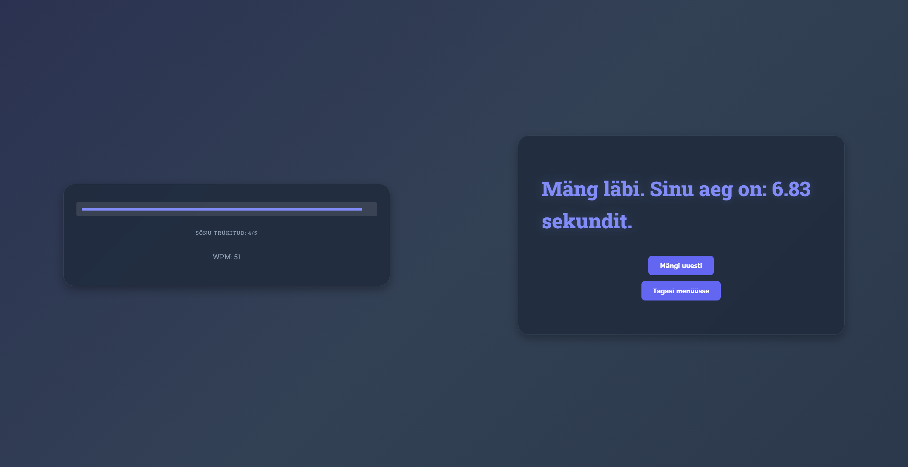
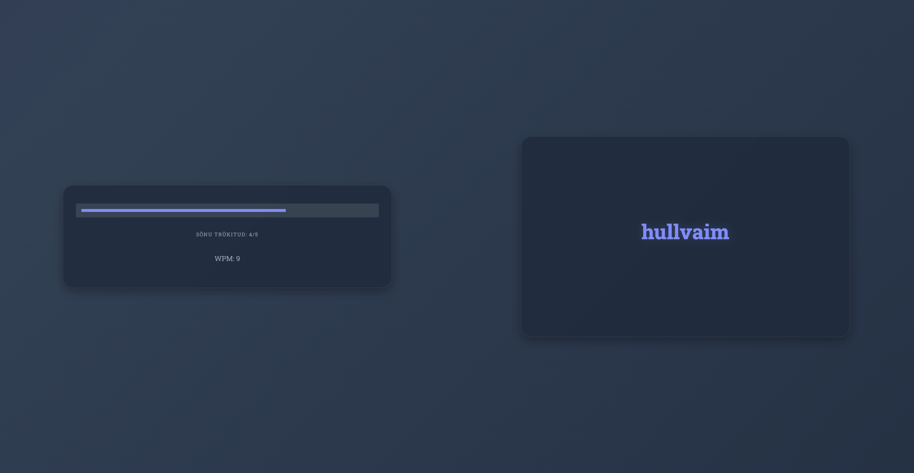
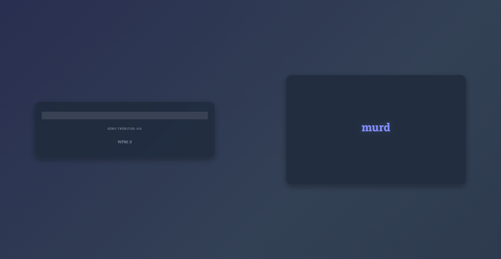
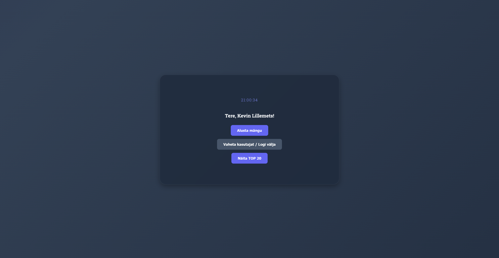
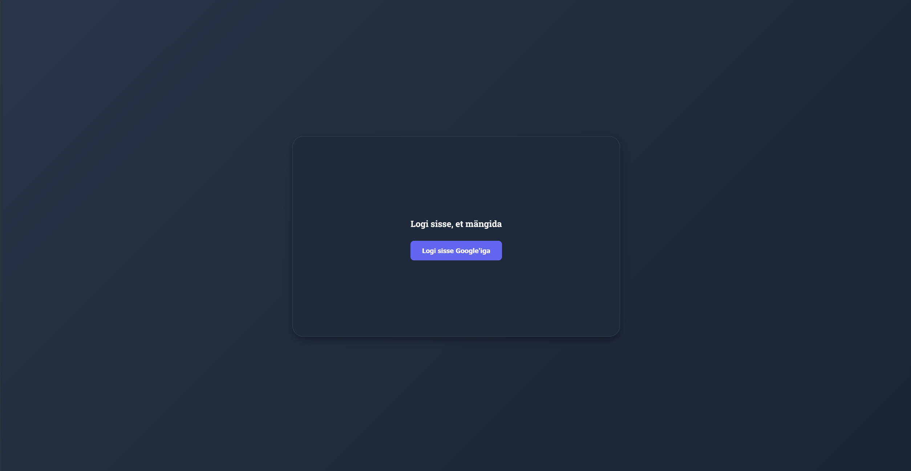

kodutoo-2, Kevin Lillemets
     

Töö võttis aega umbes neli tundi, kuid õnneks oli alus varasematest tundidest olemas. Alustasin fondi muutmisest, see oli lihtne ning ei nõudnud palju pingutamist. Siis tegin TOP 20 tulemuste tabeli, mis kuvab nime, aega, WPM ja hinnang. Hinnangu puhul kasutasin emojisid, kuna see oli lihtsam ja sobis rohkem kokku, kui pilti lisada. Siis tegelesin mobiilvaate poolega, mille jaoks kasutasin tehisintellekti. Viibe: "Aita mul rakendus mobiilivaatest paremini kasutatavaks teha, kasutades media query't. https://www.w3schools.com/css/css_rwd_mediaqueries.asp". Seejärel tegelesin CSS-iga. Võtsin natuke ideid Rinde tunnis Veeb- ja Meediaelemendid tehtud töödest. Kasutasin oma koodis viite pseudoklassi. Heliklipid valisin Pixabay-st, sain ka need rakendatud. Lisasin omalt poolt esimeseks featureks menüüsse/avalehele kella. Siis lisasin progress bari, mis liigub aktiivselt peale igat tähte. Viimaseks lisasin WPM (Words Per Minute) näitaja, mis näitab samuti peale igat klahvivajutust, kui kiiresti kasutaja klahve vajutab. Viimaseks muutsin constructoris sõnade arvu viieks. Samuti esimene sõna on 4-täheline ja iga järgnev ühe tähe võrra pikem. 